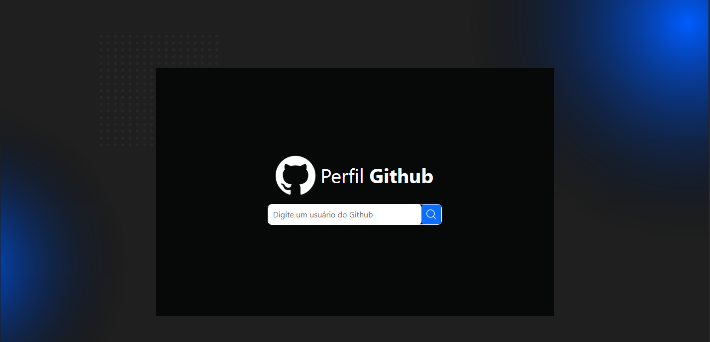

# Busca de perfil do Github com a API Github

## Descrição do Projeto  

Api de busca de perfil do Github

# Front-end:

## As Tecnologias utilizadas

- **Javascript**: linguagem de programação.

- **React**: Biblioteca 
  
-  **CSS**: Estilização da página

- **Bootstrap**:  framework de código aberto e gratuito para desenvolvimento web para trabalhar com responosividade.

## Rodando o projeto:

- **Primeiro**: Faça a clonagem do projeto por meio do git clone;

- **Segundo**: Abra o prompt de comando do projeto e dê os seguintes comandos: npm install e logo após npm run dev;

- **Terceiro**: Pronto, o projeto estará funcionando e pronto para uso.

## Imagens da aplicação 

<h3 align="center">Versão Web</h3>

  

